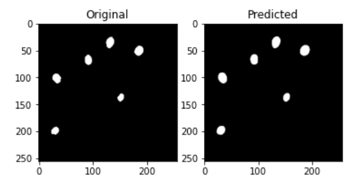
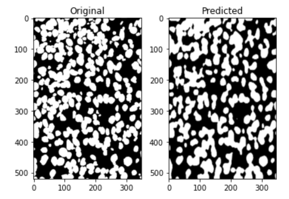

# U-Net_Keras_Kaggle
Semantic segmentation with UNet architecture using Keras.  
[]  
[]  

# Using
1. Firstly create folder, open it in IDE or text editor and clone reposytory (or download zip) 
> git clone https://github.com/Dimanar/U-Net_Keras_Kaggle.git
2. Secondly install needed libraries 
> pip install -r Requirements.txt
3. Run file predict_mask.py ( it will load the model, pedict, write to the DataFrame and save with encoded_pixels)
> python predict_mask.py

# Techniques
First of all, about preprocessing:   
    1. Resize  
    2. From RGB to GRAY  
    3. Normalization with "shift" - (x/255 * 0.99) + 0.01  
My task was the segmentation and i have to use U-Net architecture. There is a folder in the repository where 4 files are stored: 2 of them store a retrained model with 35 million parameters, the second model with regularization for 2 million parameters. For the best score, I used the lighter model.
After prediction, the model encodes the images and saves them to a file along with metrics for each image.
