# U-Net_Keras_Kaggle
Semantic segmentation with UNet architecture using Keras.  
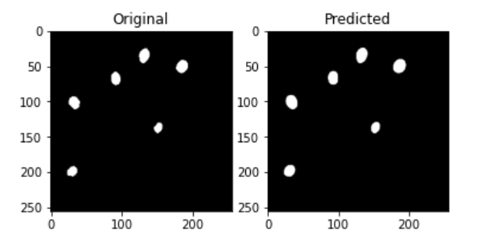  
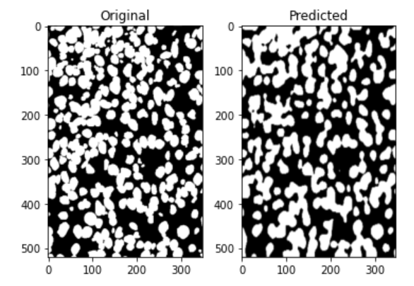 

# Using
1. Firstly create folder, open it in IDE or text editor and clone reposytory (or download zip) 
> git clone https://github.com/Dimanar/U-Net_Keras_Kaggle.git
2. Secondly install needed libraries 
> pip install -r Requirements.txt
3. Run file predict_mask.py ( it will load the model, pedict, write to the DataFrame and save with encoded_pixels)
> python predict_mask.py

# DATA overiview 
Dataset contains a large number of nuclei images and mask. All dataset split into two type of folders: (image, mask) in train folder. The test folder contain only nuclei images and .cvs file, which contain: ImageId, encoded pixels, Height, Width. All images can be divided intp several unique dimensions. For example:  
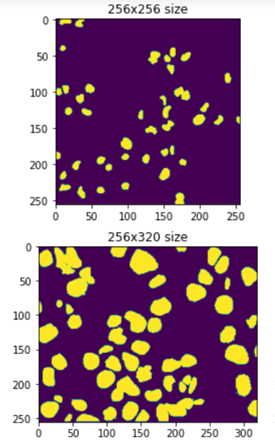     
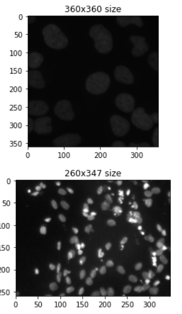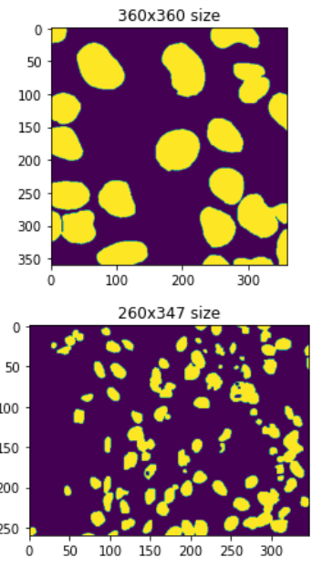  
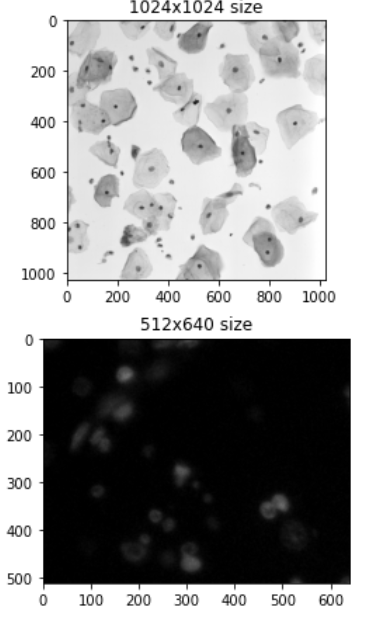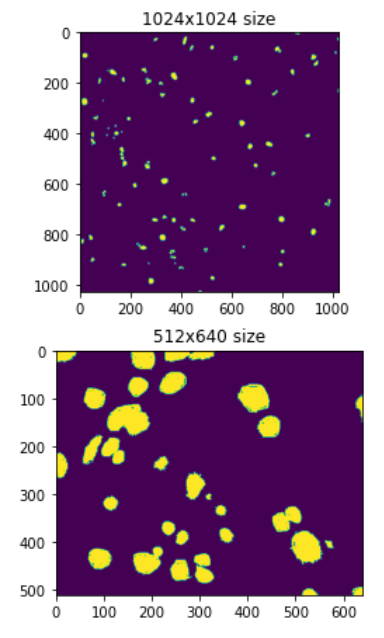  

Next step, I checked dimension of images. I noticed that images have different shapes. The most frequent image dimension in train and test set is (256, 256, 3). I made decision to resize all images and their masks to shape (256, 256, 1) - zero because I will change scale from RGB tp GRAY.  

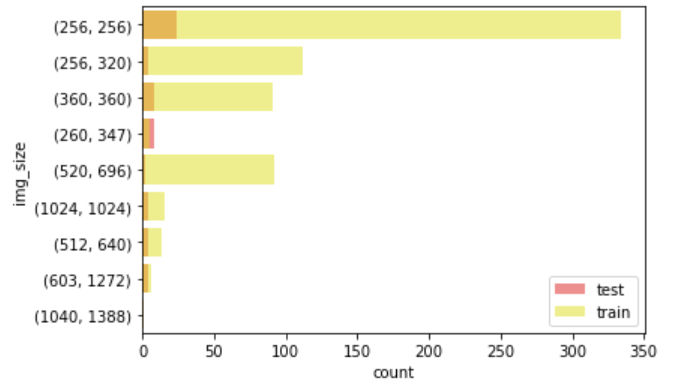

## Data preprocessing
I converted training images to grayscale and make normalization with "shift" (+0,01). Of course resize to the most frequent image dimension.

## Data augmentation
I used Keras class ImageDataGenerator to make more train data uses some tecniques:  
* rotation  
* width_shift_range  
* height_shift_range  
* vertical_flip

# Model
## Model overview
On assignment, I needed to use the UNet architecture. UNet architecture was a great step forward in computer vision that revolutionized segmentation not just in medical imaging but in other fields as well.  
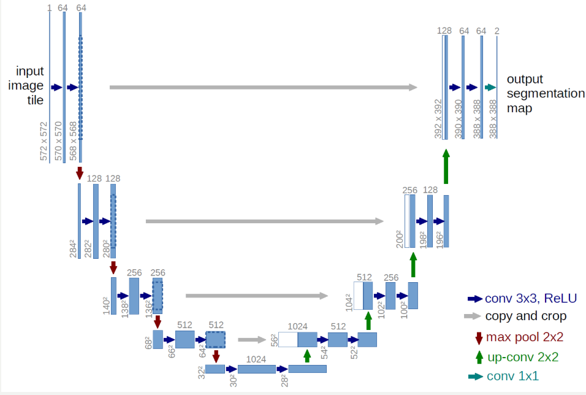 

## Loss function
1 - metric 

## Metric
The dice coefficient is a statistic used to gauge the similarity of two samples.  
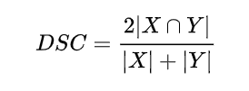  

## Model history
Unfortunately I do not habe a good computing server or as least a normal computer, so i use only 10 epochs.
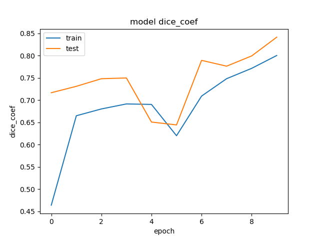   
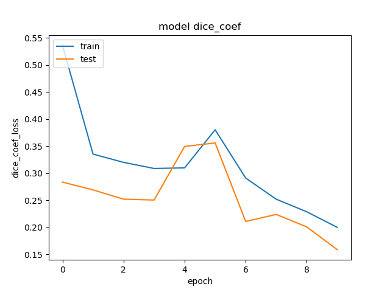  

# Results
There are 3 special picture in test data, which types were not in the train data.  
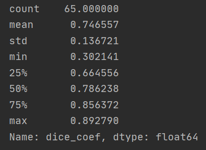

